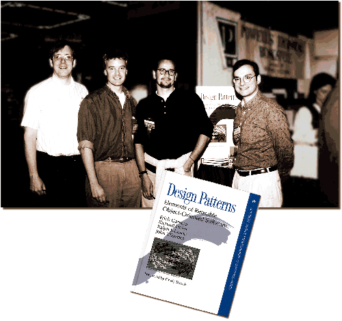

# Gang of Four Design Patterns by Example

In software engineering, Design Patterns are best practices/way to solve particular type of problems. They should occur naturally in your code  but if they are enforced, you will end up writing bloated/messy code, that's why you should be aware of patterns but before applying them, you shuold properly analyze the problem. Along with that you should also consider if language or tool you are using have already some better approach to solve the problem in standard library.

According to approach or architecture you are using you may find different patterns like Design Patterns for Cloud, Microservices, UX, OOP or IoT. Here I'll be discussing about 23 Gang of Four Design Patterns, which applies to Object Oriented Programming. They were originated from a book called **Design Patterns: Elements of Reusable Object-Oriented Software**, which was published in **1994** by 4 awesome people(*Erich Gamma, Richard Helm, Ralph Jahnson, Josn Vlissides*) who are better known as **Gang of Four**.

[Here is what wikipedia says about this](https://en.wikipedia.org/wiki/Design_Patterns)
> Design Patterns: Elements of Reusable Object-Oriented Software is a software engineering book describing software design patterns. The book's authors are Erich Gamma, Richard Helm, Ralph Johnson and John Vlissides with a foreword by Grady Booch. The book is divided into two parts, with the first two chapters exploring the capabilities and pitfalls of object-oriented programming, and the remaining chapters describing 23 classic software design patterns. The book includes examples in C++ and Smalltalk.

GoF Design Patterns are classified in 3 types, Creational, Structural and Behavioral.

> This Work is in Progress, I'll be keep adding links to patterns as they are completed

## Creational Design Patterns

* Simple Factory Pattern
* Factory Method Pattern
* Abstract Factory Pattern
* Builder Pattern
* Prototype Pattern
* Singleton Pattern

## Structural Design Patterns

* Adapter Pattern
* Bridge Pattern
* Composite Pattern
* Decorator Pattern
* Facade Pattern
* Flyweight Pattern
* Proxy Pattern

## Behavioral Design Patterns

* Chain of Responsibility Pattern
* Command Pattern
* Iterator Pattern
* Mediator Pattern
* Memento Pattern
* Observer Pattern
* Visitor Pattern
* [Strategy Pattern](Strategy-Pattern/ReadMe.md)
* State Pattern
* [Template Method Pattern](Template-Method-Pattern/ReadMe.md)
