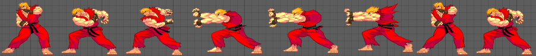
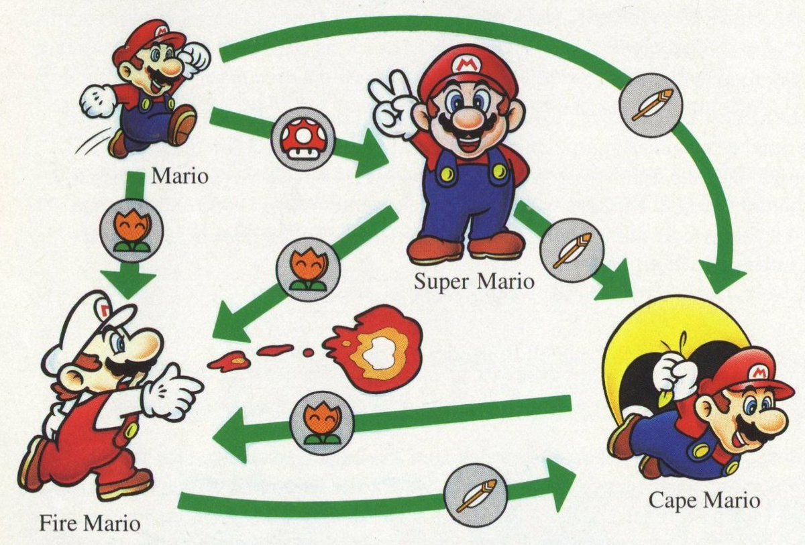
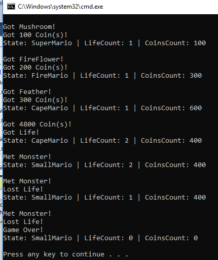

# State Design Pattern by Example



In object oriented programming State Pattern is one of the way to implement *Finite State Machines*. This pattern falls under *Behavioral Design Patterns*.

When in our software, object can transit between multiple possible states, and changes it's behaviour accoring to state, Then this type of problems can be easily solved using *[Finite State Machines](https://en.wikipedia.org/wiki/Finite-state_machine)*, and this pattern helps us to achive  this.

## Glance of Mario's State/Behaviours in Game

Here I'm taking example of **Super Mario** game, most of the people must be already aware of this nostalgic game. In this mario changes its states and behaviour based on events occurred, which you can see in below image which I got from [Mario Wiki](https://www.mariowiki.com/Super_Mario_World).



Let's observe states/behaviour and events in above image.

#### States
1. Mario (We will refer as Small Mario here after)
2. Super Mario
3. Fire Mario
4. Cape Mario
5. Lost Life (Apart from image considering this state)

#### Events
1. Got Mushroom 🍄
2. Got Fire Flower 🔥
3. Got Feather 🍃
4. Met Monster 👹 (Not shown in image, but you know Mario game. right?😉)

#### State Transition on Event Occurrence & Earning Coins

Below table demonstrates how state changes on diferent events. Apart from state change, coins are also earned on occurrence of events.

Current State | Event Occured | New State | Coins Earned
---|---|---
Small Mario | Got Mushroom 🍄 | Super Mario | 100
Small Mario | Got Fire Flower 🔥 | Fire Mario | 200
Small Mario | Got Feather 🍃 | Cape Mario | 300
Small Mario | Met Monster 👹 | Lost Life | 0
Super Mario | Got Mushroom 🍄 | Super Mario | 100
Super Mario | Got Fire Flower 🔥 | Fire Mario | 200
Super Mario | Got Feather 🍃 | Cape Mario | 300
Super Mario | Met Monster 👹 | Small Mario | 0
Fire Mario | Got Mushroom 🍄 | Fire Mario | 100
Fire Mario | Got Fire Flower 🔥 | Fire Mario | 200
Fire Mario | Got Feather 🍃 | Cape Mario | 300
Fire Mario | Met Monster 👹 | Small Mario | 0
Cape Mario | Got Mushroom 🍄 | Cape Mario | 100
Cape Mario | Got Fire Flower 🔥 | Fire Mario | 200
Cape Mario | Got Feather 🍃 | Cape Mario | 300
Cape Mario | Met Monster 👹 | Small Mario | 0

#### Earning Life

On each 5000 coins collected, one life will be awarded.


## Implementing in Code

Just to make it clear Nintendo haven't open sourced Super Mario source code yet 😜, I am just taking example to help you understand State Design Pattern, like other articles in series we will start code with some code, and will be refactoring it gradually.

### Approach 1: Creating Method for Every Events Occured

We created enum(internalState) with name of all the states, for each event we have methods, where after validating conditions we are setting **State** property value which is of **internalState** type and represents the current state of object/Mario. refer below code

> Source Code : [State Pattern / Mario / Approach1](https://github.com/AshV/GoF-Design-Patterns-by-Example/tree/master/State-Pattern/Mario/CSharp/Approach1)

```csharp
public class Mario {
    enum internalState {
        SmallMario,
        SuperMario,
        FireMario,
        CapeMario
    }

    public int LifeCount { get; private set; }
    public int CoinCount { get; private set; }
    private internalState State { get; set; }

    public Mario() {
        LifeCount = 1;
        CoinCount = 0;
        State = internalState.SmallMario;
    }

    public void GotMushroom() {
        WriteLine("Got Mushroom!");
        if (State == internalState.SmallMario)
            State = internalState.SuperMario;

        GotCoins(100);
    }

    public void GotFireFlower() {
        WriteLine("Got FireFlower!");
        State = internalState.FireMario;
        GotCoins(200);
    }

    public void GotFeather() {
        WriteLine("Got Feather!");
        State = internalState.CapeMario;
        GotCoins(300);
    }

    public void GotCoins(int numberOfCoins) {
        WriteLine($"Got {numberOfCoins} Coin(s)!");
        CoinCount += numberOfCoins;
        if (CoinCount >= 5000)
        {
            GotLife();
            CoinCount -= 5000;
        }
    }

    private void GotLife() {
        WriteLine("Got Life!");
        LifeCount += 1;
    }

    private void LostLife() {
        WriteLine("Lost Life!");
        LifeCount -= 1;
        if (LifeCount <= 0)
            GameOver();
    }

    public void MetMonster() {
        WriteLine("Met Monster!");
        if (State == internalState.SmallMario)
            LostLife();
        else
            State = internalState.SmallMario;
    }

    public void GameOver() {
        LifeCount = 0;
        CoinCount = 0;
        WriteLine("Game Over!");
    }

    public override string ToString() {
        return $"State: {State} | LifeCount: {LifeCount} | CoinsCount: {CoinCount} \n";
    }
}

class MainClass {
    static void Main(string[] args) {
        Mario mario = new Mario();
        WriteLine(mario);

        mario.GotMushroom();
        WriteLine(mario);

        mario.GotFireFlower();
        WriteLine(mario);

        mario.GotFeather();
        WriteLine(mario);

        mario.GotCoins(4800);
        WriteLine(mario);

        mario.MetMonster();
        WriteLine(mario);

        mario.MetMonster();
        WriteLine(mario);

        mario.MetMonster();
        WriteLine(mario);
    }
}
```

As you see in output it is changing state on occurence of different events.

 

#### Reviewing Approach 1

On occurence of each event, different operation can be executed based on current state of object. For example GotMushroom event, If it occurs for SmallMario it would be changed to SuperMario, but if same event occurs for SuperMario, it will remain the same. If may lead to confusion to write same conditions in each method.

### Approach 2: Moving All State Related Code To Respective Class

To address problem of approach 1, here I created separate class for each State, which all are inherited from **IState** interface.